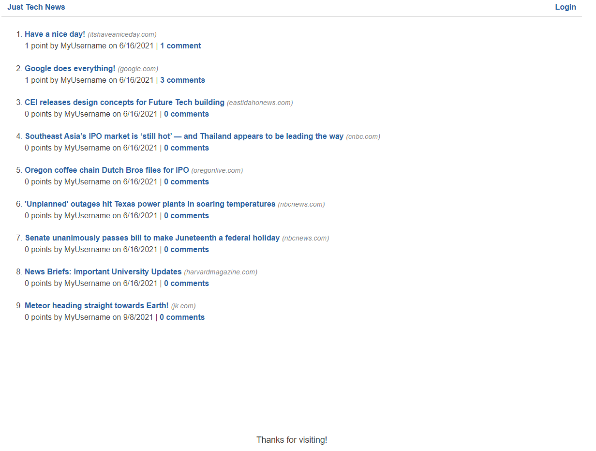

# Just Tech News

## Table of Contents
* [Deployed](#deployed)
* [Description](#description)
* [Technologies](#technologies)
* [Usage](#usage)
* [Preview](#preview)
* [Questions](#questions)
* [Credits](#credits)

## Deployed
View the application at https://pure-coast-40651.herokuapp.com/

## Description
As a developer interested in staying up to date on the latest tech news, you may be looking for a CMS-style blog site where you can publish articles, blog posts, and your thoughts and opinions. With Just Tech News, you can accomplish all this and more.

This is a full stack application embodying the Model-View-Controller paradigm. It uses a combination of front and back end technologies to deliver a clean user experience as well as a functional back-end database.

## Technologies
* Handlebars.js
* CSS
* JavaScript
* MySQL
* Sequelize
* Express.js
* Node.js
* Bcrypt
* Dotenv

## Usage
Upon first visiting the site, you will be presented with the homepage, which includes existing posts and the option to login or signup using the "Login" link in the navigation.

Clicking the title of an existing blog post will take you to the full news story shared by the creator.

Within a post, you can click on "X comments" to view comments created by other users. If you are logged in, you have the option to leave a comment and upvote the post.

Logged in users will see a link in the navigation called "Dashboard" which will take you to a page where you can view all of the posts that you've made with the option to create a new one.

Clicking the 'Edit post' link for a post in your dashboard will take you to a page where you can change your title, add a comment, or delete your post altogether.

Clicking the 'logout' link in the navigation will sign you out of the site and take you back into view-only mode.

At any time, select "Just Tech News" in the navigation to return to the home page.

## Preview

## Questions
Have questions about this project?  
GitHub: https://github.com/sarawrmas  
Email: sara.m.adamski@gmail.com

## Credits
Sara Adamski